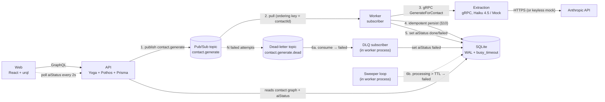
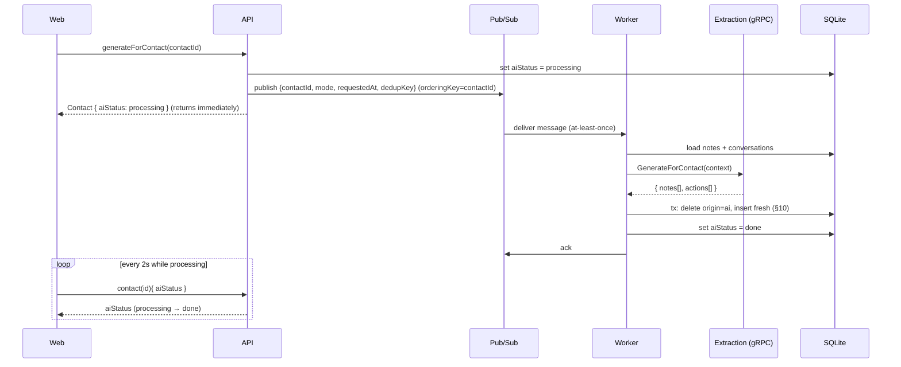
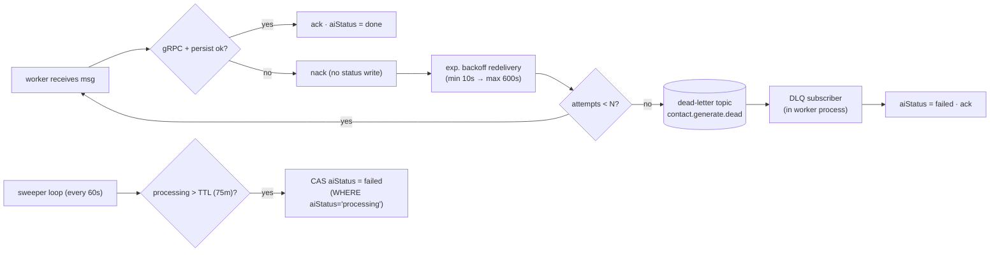
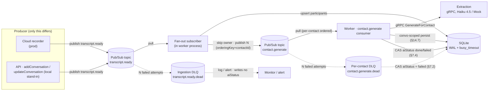
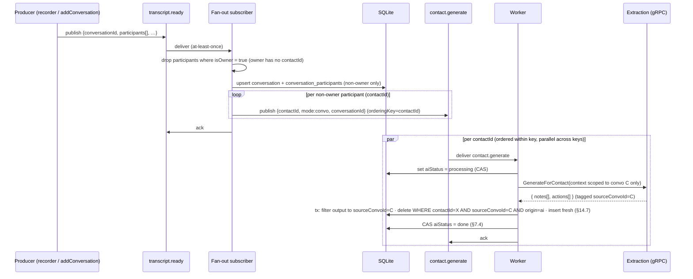

# Taperoot — Pub/Sub for AI Follow-up Generation

> *Durable triggers for what grows after the tap.*
> Replacing the in-process background promise with a retryable Pub/Sub queue.

| | |
|---|---|
| **Author** | Danny Nguyen |
| **Date** | 2026-06-24 |
| **Status** | DESIGN_APPROVED |
| **Version** | v9 |
| **Lifecycle** | [x] Design  [x] Design review  [ ] Implementation  [ ] Code review  [ ] QA |
| **Builds on** | [`doc/DESIGN.md`](./DESIGN.md) — §5 (architecture), §7–§8 (generation), §10 (idempotency), §16–§20 (phases, trade-offs, integration surface) |
| **Scope** | Design + plan only. No implementation. |

---

## 1. Problem statement — why the in-process promise is insufficient

Today generation is **fire-and-forget inside the API process** ([DESIGN.md §8](./DESIGN.md#8-extraction-service-grpc)). `generateForContact` sets `aiStatus: processing`, then calls `void triggerGeneration(...)` — an **un-awaited promise** — and returns immediately. The web client polls `contact(id){ aiStatus }` every 2s until `done`/`failed`.

The async *shape* is right; the *substrate* is brittle. The work lives only in the API's heap:

| Weakness | What happens today | Consequence |
|---|---|---|
| **No durability** | API restarts (deploy, crash, OOM) mid-flight | Work silently lost; nothing resumes it |
| **Stuck status** | The promise that would set `done`/`failed` dies with the process | `aiStatus` is pinned to `processing` **forever** — UI polls indefinitely |
| **No retries** | A transient gRPC/Anthropic error → `catch` → `aiStatus: failed` | One blip = terminal failure; user must manually re-click Generate |
| **No backpressure** | N concurrent generates = N concurrent un-awaited promises + N gRPC calls | Anthropic rate-limit storms; no queue to smooth bursts |
| **No horizontal scale** | The promise is bound to the process that received the mutation | Can't add API replicas to drain a backlog; work isn't shareable |
| **No ordering control** | Two rapid generates for the same contact race | Concurrent delete+insert on the same contact's AI rows (see §6) |

The system already declared "this step is async, slow, bursty, and swappable" ([DESIGN.md §5](./DESIGN.md#5-architecture)). It just never gave that async step a **durable medium**. Pub/Sub *is* that medium — it formalises the seam the design already wanted.

---

## 2. Two integration shapes

The choice is **not** "gRPC vs Pub/Sub" — they answer different questions. gRPC is a *typed request/response compute contract*; Pub/Sub is a *durable trigger/queue*. The real decision is **where the durable boundary sits**.

### Shape A — Pub/Sub triggers, gRPC computes ✅ recommended

API **publishes** a `contact.generate` event and returns. A **worker** (subscriber) pulls the event, calls the **existing** extraction gRPC, persists idempotently (§10 logic unchanged), and sets the terminal `aiStatus`. Pub/Sub adds durability exactly where the system already went async; the justified gRPC compute contract is preserved verbatim.

### Shape B — Pub/Sub replaces gRPC ❌ rejected

The API publishes a "generate" event; the extraction service subscribes directly and publishes results back on a second topic; the API subscribes to *that* to persist. gRPC is deleted.

### Comparison

| Dimension | A — Pub/Sub triggers + gRPC computes | B — Pub/Sub replaces gRPC |
|---|---|---|
| Typed request/response | ✅ keeps proto contract ([DESIGN.md §8](./DESIGN.md#8-extraction-service-grpc)) | ❌ request/response splits into two fire-and-forget topics |
| Durability of trigger | ✅ event survives API restart | ✅ event survives API restart |
| Correlating result → request | ✅ synchronous gRPC return value | ❌ must hand-roll correlation IDs + a result topic |
| Blast radius of change | Small — swap the *trigger*, reuse compute | Large — rewrite extraction transport + API persistence path |
| Backpressure / retries | ✅ subscription redelivery + DLQ | ✅ but on **two** hops, doubling failure surface |
| Preserves §5 rationale | ✅ "gRPC for the one real seam" still true | ❌ discards the deliberate typed seam |
| Local keyless run | ✅ emulator + MockExtractor | ✅ but two subscribers to wire in the emulator |
| Net new concepts | 1 topic, 1 sub, 1 worker | 2 topics, 2 subs, correlation protocol, result schema |

### Recommendation

**Adopt Shape A.** It treats Pub/Sub and gRPC as complementary: Pub/Sub owns *"this work must happen, durably, eventually"*; gRPC owns *"given this context, return these notes + actions, typed"*. Shape B throws away [DESIGN.md §5](./DESIGN.md#5-architecture)'s deliberately-chosen typed seam to solve a durability problem that lives entirely on the *trigger* side, and pays for it with a bespoke correlation protocol. **A is strictly less change for strictly more durability.**

---

## 3. Target architecture

### 3.1 Component diagram



Changes vs [DESIGN.md §5](./DESIGN.md#5-architecture): four new boxes — the **Pub/Sub topic/subscription**, the **Worker**, and the worker-hosted **DLQ subscriber** + **sweeper** (§7). The Web↔API↔SQLite and Worker→Extraction→Anthropic edges are unchanged. The API no longer holds the background promise; it only **publishes**. All Pub/Sub boxes exist **only** under `GENERATION_TRANSPORT=pubsub`; the default keyless run uses `inprocess` and instantiates none of them (§9.3, §10).

> **Extended by §14.** This diagram shows the single-contact trigger path. §14 ("Conversation ingestion & per-participant fan-out") adds an upstream `transcript.ready` ingestion topic and a fan-out subscriber that emits **N** `contact.generate` messages (one per identified participant) into exactly this same topic+worker; see §14.6 for the extended architecture and event-sequence diagrams.

### 3.2 Event sequence



On failure the worker **nacks**; Pub/Sub redelivers with backoff; after N attempts the message is dead-lettered. A dedicated **DLQ subscriber** then sets `aiStatus: failed`, with a periodic **sweeper** as backstop for any lost terminal delivery (§7).

---

## 4. Topics & subscriptions design

One topic, one primary subscription, one dead-letter topic.

| Resource | Name | Type | Notes |
|---|---|---|---|
| Topic | `contact.generate` | — | Single trigger for all generation (both `convo` and `notes-only` modes) |
| Subscription | `contact.generate.worker` | **pull** | Worker pulls; see push-vs-pull below |
| Dead-letter topic | `contact.generate.dead` | — | Messages exceeding `maxDeliveryAttempts` land here |
| DLQ subscription | `contact.generate.dead.worker` | pull | Consumed by the **DLQ subscriber** (§7.2), which sets `aiStatus: failed` for dead-lettered contacts |

### 4.1 Message schema (payload)

Published as a JSON `Buffer` in `message.data`. `orderingKey` is set to `contactId`.

```jsonc
{
  "contactId":  "c_123",          // required — the contact to generate for
  "mode":       "convo",          // "convo" | "notes-only" (mirrors triggerGeneration's mode)
  "conversationId": "cv_9",       // optional — present on fan-out (§14): scopes idempotency to one convo slice
  "requestedAt":"2026-06-24T11:52:00.000Z", // ISO; for latency metrics + staleness checks
  "dedupKey":   "c_123:cv_9:1750766400" // contactId (+ convoId on fan-out) + coarse timestamp bucket; for dedup (§6)
}
```

| Field | Type | Required | Purpose |
|---|---|---|---|
| `contactId` | string | yes | Subject of generation; also the **ordering key** |
| `mode` | `"convo" \| "notes-only"` | yes | Selects which context the worker sends (notes-only ⇒ latest note only, [DESIGN.md §8](./DESIGN.md#generation-rules)) |
| `conversationId` | string | no | Set by the **fan-out subscriber** (§14.6); when present the worker scopes **both its extraction input** (gRPC `ContactContext` limited to convo C) **and its delete+insert** to that one convo's slice (convo-scoped idempotency, §14.7). Absent on the single-contact / notes-only path ⇒ existing §10 contact-wide behaviour |
| `requestedAt` | ISO string | yes | Observability + optional staleness drop |
| `dedupKey` | string | yes | Coalesces rapid duplicate triggers for the same contact (§6); includes `conversationId` on the fan-out path so different convos for one contact don't dedup each other |

`messageId` and `orderingKey` are Pub/Sub envelope fields, not body fields.

### 4.2 Push vs pull — recommend **pull**

| | Pull (worker pulls) ✅ | Push (Pub/Sub POSTs to an HTTP endpoint) |
|---|---|---|
| Backpressure | Worker controls concurrency (`flowControl.maxMessages`) | Pub/Sub controls rate; harder to throttle Anthropic |
| Local emulator fit | Native — `subscription.on('message')` | Needs a reachable HTTP endpoint; awkward in compose |
| Ordering keys | Supported on pull | Supported but couples ordering to HTTP delivery |
| Fits our worker | ✅ long-lived subscriber loop | Would force the worker to be an HTTP server |

Pull matches a long-lived worker draining a queue and gives us direct control over Anthropic-facing concurrency.

### 4.3 Ack deadline

| Setting | Value | Rationale |
|---|---|---|
| `ackDeadlineSeconds` | **60** | Haiku 4.5 + persist comfortably finishes well under 60s; the client library **auto-extends** the lease (lease management) while the handler runs, so a slow LLM call won't cause premature redelivery |
| `flowControl.maxMessages` | **5** | Cap concurrent in-flight generations → bounded Anthropic pressure (backpressure) |
| `enableMessageOrdering` | **true** | Required for ordering keys (§6) |

---

## 5. New / changed components

### 5.1 The worker — fold into `extraction` or stand alone?

| Option | Pros | Cons |
|---|---|---|
| **Standalone `worker` service** ✅ | Clean single responsibility; scales independently; its restart never touches the gRPC server; mirrors [DESIGN.md §5](./DESIGN.md#5-architecture)'s "one box per seam" ethos | One more container |
| Fold into `extraction` | No new container | Conflates *transport/orchestration* (subscribe, persist, status) with *pure compute* (LLM call); the worker needs Prisma, which the extraction service deliberately does **not** have today |

**Recommendation: a thin standalone `worker` service.** Decisive reason: the worker must **write to SQLite via Prisma** (idempotent persist + status transitions), but the extraction service is intentionally Prisma-free — it only computes. Folding in would drag the data layer into the compute service and break that separation. The worker reuses the **same `ExtractionClient` wrapper** ([DESIGN.md §8](./DESIGN.md#8-extraction-service-grpc)) the API uses today, so the gRPC call site is shared, not duplicated.

> **Honest trade-off:** for a 3-hour PoC a fourth container is real cost (image, compose entry, emulator dependency). It is accepted because it is the *only* place the durability problem actually lives, and because the migration flag (§10) lets the keyless demo run without it.

### 5.2 Where `aiStatus` transitions move

| Transition | Today | With Pub/Sub |
|---|---|---|
| `idle → processing` | API, inside `generateForContact` / `addNote` | **API, at publish time** (unchanged location, now immediately before `publish`) |
| `processing → done` | API background promise | **Worker**, after idempotent persist |
| `processing → failed` (dead-lettered) | API `catch` | **DLQ subscriber**, after the message exhausts retries and dead-letters (§7.2) |
| `processing → failed` (stuck/lost) | — (could hang forever) | **Sweeper**, when `processing` exceeds `STUCK_PROCESSING_TTL` (§7.3) |

The eligibility guard (≥1 note or conversation) and the "skip if already `processing`" guard stay in the API mutation, **before** publish — we never enqueue ineligible or duplicate-in-flight work.

### 5.3 Code-level deltas (described, not implemented)

- **API**: `triggerGeneration(...)`'s body (load context → gRPC → persist → status) **moves to the worker**. The API mutation keeps only: eligibility guard → set `processing` + `processingStartedAt = now` → `publishGenerateEvent(contactId, mode)`.
- **New `services/worker/`**: a `@google-cloud/pubsub` pull subscriber whose `onMessage` handler *is* the relocated `triggerGeneration` logic, reusing `createExtractionClient()` and the existing Prisma `db.ts`. The **same process** also hosts the **DLQ subscriber** (consumes `contact.generate.dead.worker` → sets `aiStatus: failed`) and the **sweeper** interval loop (§7) — three responsibilities, one container.
- **New `lib/pubsub.ts`** (shared): topic/subscription bootstrap (`ensureTopology()`), a typed `publishGenerateEvent`, and message-schema zod validation at the consume boundary (consistent with [DESIGN.md §6](./DESIGN.md#6-data-model)'s "validate the one untyped boundary"). The `PubSub` client is constructed **lazily and only under `GENERATION_TRANSPORT=pubsub`** (§9.3), so the `inprocess` path never touches Pub/Sub.
- **Additive DB column**: `contacts.processingStartedAt DateTime?` (nullable, set when `aiStatus → processing`). Powers the sweeper's stuck-detection query (§7.3). Additive and nullable ⇒ a safe migration; the GraphQL **type schema still need not change** (the column need not be exposed).

### 5.4 SQLite multi-writer strategy — keep the worker a writer, make SQLite safe

[DESIGN.md §5](./DESIGN.md#5-architecture) chose SQLite for a **single-writer** PoC. Pub/Sub adds a *second* writing process: the API still writes `aiStatus: processing` at publish time, and the worker writes the §10 persist + terminal status. Two OS processes opening the same embedded file can collide on SQLite's database-level write lock → `SQLITE_BUSY`.

**Decision: enable WAL mode + a `busy_timeout`; keep the worker as a direct Prisma writer.** This is the smallest change that makes two writers safe and preserves §5.1's reason for a standalone worker (it owns Prisma persistence).

| Mechanism | Setting | Effect |
|---|---|---|
| Write-Ahead Logging | `PRAGMA journal_mode = WAL` (persisted in the DB file; set once during migrate/seed) | Readers never block the writer and vice-versa — the API's contact-graph reads never collide with worker writes; only *writer-vs-writer* is serialised |
| Busy timeout | `PRAGMA busy_timeout = 5000` (per connection, on both API and worker Prisma clients) | A writer that meets a held write-lock **waits and retries** up to 5s instead of throwing `SQLITE_BUSY` immediately |

**Why this is sufficient here:** writes are tiny and short — the API writes one/two columns (`aiStatus` + `processingStartedAt`); the worker runs one short §10 transaction per message. Per-contact **ordering keys** (§6) already serialise a contact's worker writes, and `WORKER_MAX_CONCURRENCY = 5` caps total in-flight worker writes; with WAL serialising writers and `busy_timeout` absorbing the rare overlap, contention is negligible for a PoC.

**Escape hatch (removes the constraint entirely):** [DESIGN.md §17](./DESIGN.md#17-trade-offs-accepted) already notes Postgres is a **one-line `datasource` change**. Under Postgres (MVCC, true concurrent writers) the WAL/`busy_timeout` workaround is unnecessary and the multi-writer concern disappears outright — the production path if write volume ever outgrows SQLite.

---

## 6. Delivery semantics — at-least-once ⇒ duplicates

Pub/Sub guarantees **at-least-once** delivery: the same message may arrive more than once (redelivery after a missed ack, or genuine duplicate publishes from rapid user clicks).

### 6.1 What's already safe

[DESIGN.md §10](./DESIGN.md#10-idempotency-of-generatefollowups) makes a *sequential* re-run converge: delete `origin=ai` notes + `origin=ai, status=open` followups, then insert fresh; never touch `manual`/`user`/`done`. So a duplicate processed **after** the first completes simply re-derives the same set — **no new risk** for serial duplicates.

### 6.2 The new risk — concurrent duplicate delivery

If two deliveries for the **same contact** run **at the same time**, they interleave on the shared delete+insert:

```
W1: deleteMany(origin=ai)         W2: deleteMany(origin=ai)
W1: createMany(actions)           W2: createMany(actions)   ← both insert → duplicates
```

The §10 transaction protects each run's *internal* consistency, but two concurrent runs can both delete-then-insert, yielding doubled AI rows — violating the hard idempotency constraint.

### 6.3 Mitigations

| Mitigation | Mechanism | Verdict |
|---|---|---|
| **Ordering key = `contactId`** ✅ primary | Pub/Sub delivers messages with the same ordering key **one at a time, in order**; the next isn't delivered until the current is acked | Serialises per contact → eliminates the concurrent-race entirely while still parallelising across *different* contacts |
| Dedup on `dedupKey` | Worker keeps a short-lived seen-set / DB unique row of `dedupKey`; drops repeats within a bucket | Useful to coalesce rapid double-clicks; secondary |
| Per-contact processing lock | Advisory lock / `aiStatus`-guarded conditional update before processing | Redundant once ordering keys serialise per contact; keep as belt-and-braces only |

**Primary recommendation: ordering keys = `contactId`.** It turns "concurrent duplicates" into "sequential duplicates", which §10 already handles. `dedupKey` is retained as a cheap coalescing optimisation for double-clicks. The per-contact lock is **not** adopted as the primary path (ordering keys make it redundant — YAGNI) — but it is the fallback in §6.5.

### 6.4 Exact ordering requirements for correctness

Ordered delivery is guaranteed **only** when all of the following hold. Missing any one silently degrades to unordered — and the concurrent race in §6.2 returns:

| # | Requirement | Where set | Note |
|---|---|---|---|
| 1 | Every message published **with an `orderingKey`** | the publish call | Key = `contactId`; a message published with no key is delivered unordered |
| 2 | Publisher created with `enableMessageOrdering: true` | `pubsub.topic(name, { enableMessageOrdering: true })` | Without it the client **rejects** any publish that carries an ordering key |
| 3 | Subscription **created with message ordering enabled** | `createSubscription(..., { enableMessageOrdering: true })` | Must be set at *creation* — it cannot be toggled on an existing subscription; `ensureTopology()` sets it |
| 4 | All messages for a key published to the **same region** | a single regional publish endpoint (e.g. `us-east1-pubsub.googleapis.com:443`) | Ordering is only guaranteed within one region; pinning the publisher to one regional endpoint stops a key's messages splitting across regions |
| 5 | Ordering scope is **per ordering key**, never global | semantics | Messages with *different* keys have **no** mutual ordering — exactly what we want |

Guarantee: for a given `contactId`, Pub/Sub delivers the next message **only after the current one is acked**; a nack/redelivery of message *k* blocks *k+1* for that key until *k* succeeds or dead-letters. One ordered key is therefore handled by exactly one worker at a time.

### 6.5 Scaling trade-off and the dedup fallback

- **Serialises within a key, parallelises across keys.** Strict per-`contactId` ordering means one contact's messages run one-at-a-time; this *is* the correctness guarantee we want. **Different contacts still fan out across all workers**, so adding worker replicas scales throughput across keys while preserving per-contact order. Ordered delivery + multiple workers thus parallelises **across** keys but serialises **within** a key.
- **Emulator caveat.** The Pub/Sub emulator implements ordering keys but does **not** model regions (requirement #4 is a no-op locally) and has had ordering edge-cases across emulator versions. Treat local ordered behaviour as indicative, not authoritative.
- **Fallback if strict ordering is unavailable** (a broken-ordering emulator build, or a deployment that can't pin a region): fall back to **dedup + per-contact lock** — (a) drop redeliveries whose Pub/Sub `messageId`/`dedupKey` was already processed (short-lived seen-set or a unique row), and (b) guard the §10 persist with a conditional write (`UPDATE contacts SET aiStatus='processing' WHERE id=? AND aiStatus<>'processing'`-style advisory lock) so only one concurrent run mutates a contact's AI rows. This restores correctness without ordering, at the cost of occasional wasted recompute.

---

## 7. Failure handling — guaranteeing a terminal `aiStatus`

The retry story the in-process promise never had — plus two independent mechanisms that ensure **every** request ends at `done` or `failed`, never pinned at `processing`.



### 7.1 Retry + dead-letter policy

| Concern | Setting | Value |
|---|---|---|
| Redelivery backoff | `retryPolicy.minimumBackoff` / `maximumBackoff` | `10s` → `600s` |
| Max attempts before dead-letter | `deadLetterPolicy.maxDeliveryAttempts` | **5** |
| Max processing budget per attempt | `MAX_PROCESSING_BUDGET` (≈ `ackDeadlineSeconds`, §4.3) | **60s** |
| Dead-letter topic | `deadLetterPolicy.deadLetterTopic` | `contact.generate.dead` |

The primary worker **never tries to detect "the final attempt"** — on any error it simply nacks and writes no status. Reliably setting `failed` is delegated to the two mechanisms below, which close the gap the previous draft left open: a lost final delivery, worker crash, or lease expiry could otherwise leave `aiStatus` at `processing` forever. These numbers also pin the **retry envelope** the sweeper TTL must clear (§7.3): the worst-case wall-clock a request can legitimately spend retrying is bounded by `maxDeliveryAttempts × (maximumBackoff + MAX_PROCESSING_BUDGET)`.

### 7.2 Primary — DLQ subscriber (in the worker process)

A second subscription, `contact.generate.dead.worker`, is consumed by a **DLQ subscriber** running inside the same worker container. For each dead-lettered message it parses the original payload and sets `aiStatus: failed` via a **conditional compare-and-set** (CAS) — the write only transitions `processing → failed`:

```sql
UPDATE contacts SET aiStatus = 'failed' WHERE id = ? AND aiStatus = 'processing'
```

If the row already left `processing` (e.g. a successful redelivery set `done`), the statement matches **zero rows** and is a no-op — so a late DLQ message can never clobber a `done`. Then it acks. This guarantees any message Pub/Sub gives up on produces a terminal `failed`, while the CAS makes the write race-safe (§7.4).

### 7.3 Backstop — sweeper / reaper

Pub/Sub's delivery of the dead-letter message is itself at-least-once and could, in principle, be lost (or the DLQ subscriber could be down). A periodic **sweeper** loop (in the worker process, every `SWEEPER_INTERVAL`, default 60s) runs:

```sql
UPDATE contacts SET aiStatus = 'failed'
WHERE aiStatus = 'processing'
  AND processingStartedAt < (now - STUCK_PROCESSING_TTL)
```

This `WHERE aiStatus = 'processing'` clause is itself the same race-safe **compare-and-set** as §7.2: the sweep only ever transitions `processing → failed` and never touches a row that already reached a terminal state.

**TTL must clear the whole retry envelope.** The sweeper is a backstop for *lost/crashed* deliveries, **not** a competitor to in-flight retries, so its TTL must sit strictly beyond the entire legitimate retry sequence. Using the §7.1 numbers:

```
worst-case retry wall-clock
  ≤ maxDeliveryAttempts × (maximumBackoff + MAX_PROCESSING_BUDGET)
  =        5            × (    600s       +        60s          )
  =        5            ×            660s
  =        3300s  ≈  55m            (conservative: counts a full backoff before every attempt)
```

Adding a safety margin (~20m) for dead-letter delivery latency and clock skew and rounding up:

> **`STUCK_PROCESSING_TTL` default = `75m`** — strictly greater than the ~55m worst-case retry envelope.

Because `75m > 55m`, the sweeper can **never** fire while Pub/Sub still has valid retries pending for a contact: by the time `processingStartedAt` is older than 75m, the message has already exhausted all 5 attempts and been dead-lettered (or its delivery was genuinely lost). It therefore only ever fires for genuinely stuck contacts, never for ones still legitimately retrying — closing the race C-6 raised. (For tests, `STUCK_PROCESSING_TTL` is overridden to a few seconds; §12 Phase 5.)

| Mechanism | Catches | Lives in |
|---|---|---|
| DLQ subscriber (primary) | Any message exhausted to the dead-letter topic | Worker process |
| Sweeper (backstop) | A `processing` contact with no terminal write past TTL (lost DLQ delivery, crash window) | Worker process |

Together these make **"every generation request reaches `done` or `failed`"** a property the design actually backs (DS-6). A transient error (attempts `< N`) still correctly leaves `aiStatus: processing` and relies on redelivery — the resilience missing today, where a single blip is terminal.

### 7.4 Race-safe terminal writes — compare-and-set, sticky terminal status

Three writers can produce a terminal `aiStatus` for one request: the **worker** (`done` after a successful run), the **DLQ subscriber** (`failed`, §7.2), and the **sweeper** (`failed`, §7.3). To make the end state deterministic, **every** terminal write is a **conditional compare-and-set guarded on `aiStatus = 'processing'`**, and **terminal status is sticky** (first terminal writer wins; once a row leaves `processing` no other writer touches it):

| Writer | Terminal write (CAS) |
|---|---|
| Worker (success) | `UPDATE contacts SET aiStatus='done' WHERE id=? AND aiStatus='processing'` |
| DLQ subscriber (§7.2) | `UPDATE contacts SET aiStatus='failed' WHERE id=? AND aiStatus='processing'` |
| Sweeper (§7.3) | `UPDATE contacts SET aiStatus='failed' WHERE id=? AND aiStatus='processing' AND processingStartedAt < now-TTL` |

The worker runs the §10 persist **and** its CAS inside one transaction, with the CAS acting as the **claim/gate**: it executes the `done` CAS first; if it matches **1 row** it proceeds with the §10 delete+insert and commits; if it matches **0 rows** (the request was already finalized) it **rolls back the persist**, acks, and returns. This makes the data write and the status write atomic and gated by the same condition, so a late run can neither flip the status nor resurrect AI rows.

Resulting precedence — deterministic in every interleaving:

- **Success before failure** (the common case): the worker's `done` CAS matches 1 row → status `done`, AI rows written. Any later DLQ/sweeper `failed` CAS matches 0 rows → no-op. **Success wins.**
- **Failure before a late success** (lost-delivery corner only): a DLQ/sweeper `failed` CAS matches 1 row → status `failed`. A late retry that then succeeds finds its `done` CAS matching 0 rows → it **rolls back and drops** (no status flip, no AI-row resurrection). **Terminal status is sticky; the late success is dropped.**

We choose *sticky terminal status* over *success-overwrites-failed* because it is simpler and strictly deterministic, it avoids resurrecting AI rows underneath a `failed` UI, and — now that the TTL strictly exceeds the retry envelope (§7.3) — the "failed then a still-pending retry succeeds" case is essentially unreachable: the sweeper cannot fire mid-retry, and the DLQ subscriber only runs *after* all 5 attempts have already failed, so there is no in-flight success left to lose. The sticky rule is therefore belt-and-braces for the lost-delivery corner alone, and the CAS + §10 idempotency make the final state deterministic regardless of delivery interleaving.

---

## 8. Keyless local-run preservation

[DESIGN.md §14](./DESIGN.md#14-running-it-docker) / [§9](./DESIGN.md#9-ai-extraction-logic) make "`docker compose up`, no `ANTHROPIC_API_KEY`, MockExtractor runs the whole app" a product goal. Pub/Sub must not break it.

**Use the Pub/Sub emulator.** `@google-cloud/pubsub` transparently targets the emulator when `PUBSUB_EMULATOR_HOST` is set — no GCP project, account, or credentials for local dev.

| Aspect | Local (keyless) | Real GCP |
|---|---|---|
| Transport | Emulator container | Managed Pub/Sub |
| Env | `PUBSUB_EMULATOR_HOST=pubsub:8085` | *(unset)* + `GOOGLE_APPLICATION_CREDENTIALS=/path/sa.json` |
| Project | `PUBSUB_PROJECT_ID=taperoot-local` (any string) | real project id |
| Extraction | MockExtractor (no key) | Haiku 4.5 (with key) |
| Swap cost | — | drop `PUBSUB_EMULATOR_HOST`, add SA creds |

### 8.1 New compose services — gated behind a `pubsub` profile

The emulator **and** the worker start **only** under the `pubsub` compose profile, so the default keyless `docker compose up` (api + extraction + web, `GENERATION_TRANSPORT=inprocess`) never depends on Pub/Sub at all (§9.3, addresses C-4):

```yaml
pubsub:
  image: gcr.io/google.com/cloudsdktool/cloud-sdk:emulators
  command: gcloud beta emulators pubsub start --host-port=0.0.0.0:8085 --project=taperoot-local
  ports: ["8085:8085"]
  profiles: ["pubsub"]          # only with `docker compose --profile pubsub up`

worker:
  build: { context: ., dockerfile: services/worker/Dockerfile }
  environment:
    GENERATION_TRANSPORT: pubsub
    PUBSUB_EMULATOR_HOST: pubsub:8085
    PUBSUB_PROJECT_ID: taperoot-local
    DATABASE_URL: file:/data/taperoot.db
    EXTRACTION_ADDR: extraction:50051
  volumes: ["./data:/data"]
  depends_on: ["pubsub", "extraction"]
  profiles: ["pubsub"]
```

Under the `pubsub` profile, `api` additionally gets `GENERATION_TRANSPORT=pubsub` + `PUBSUB_EMULATOR_HOST=pubsub:8085` + `PUBSUB_PROJECT_ID=taperoot-local`. Outside the profile, `api` runs with the default `GENERATION_TRANSPORT=inprocess` and **no** `PUBSUB_EMULATOR_HOST`, so it never constructs a Pub/Sub client. The emulator is **in-memory** (topics/subscriptions vanish on restart), so topology is (re)created on boot (§9.3) — fine and even desirable for a demo.

| Command | Services up | Transport |
|---|---|---|
| `docker compose up` | api, extraction, web | `inprocess` — keyless, no Pub/Sub touched |
| `docker compose --profile pubsub up` | + pubsub, worker | `pubsub` — durable queue |

> **Honest trade-off:** the emulator is durable only for the process's lifetime, so a `pubsub` container restart loses queued messages — weaker than real Pub/Sub. Accepted for local dev; production uses managed Pub/Sub with true durability. Crucially this is still **strictly better than today**, where an *API* restart loses in-flight work; here only an emulator restart does, and the API/worker can restart freely.

---

## 9. Schema / contract changes

### 9.1 GraphQL mutation behaviour

There are **two distinct producer paths**, and they publish to **different topics** — keep them unambiguous:

- **Direct single-contact path → `contact.generate`** (the §1–§13 trigger): `generateForContact` (explicit button) and `addNote` (notes-only). These publish a `contact.generate` message directly, for **one** contact.
- **Ingestion / fan-out path → `transcript.ready`** (the §14 feature): `addConversation` and `updateConversation`. These publish a `transcript.ready` ingestion event; the **fan-out subscriber** (§14.6) is the single place that then emits **N** `contact.generate` messages, one per non-owner participant. They do **not** publish `contact.generate` directly.

| Mutation | Today | With Pub/Sub | Topic |
|---|---|---|---|
| `generateForContact` | set `processing`, `void triggerGeneration` | set `processing`, **publish** a single-contact event; return immediately (signature **unchanged**) | `contact.generate` (direct) |
| `addNote` (notes-only path) | set `processing`, `void triggerGeneration(notes-only)` | set `processing`, **publish** `{mode: "notes-only"}` | `contact.generate` (direct) |
| `addConversation` | **saves only**, no trigger ([DESIGN.md §7](./DESIGN.md#7-graphql-api)) | saves + **publishes `transcript.ready`** (the ingestion event, §14.3/§14.8), gated by `AUTO_GENERATE_ON_CONVERSATION` (default off); the fan-out then enqueues per-participant `contact.generate`. **Not** a direct `contact.generate` publish. See §9.2. | `transcript.ready` (fan-out) |
| `updateConversation` (new, §14.8) | — (did not exist) | saves + **republishes `transcript.ready`** for the convo so every participant's slice regenerates | `transcript.ready` (fan-out) |

**The GraphQL type schema *does* change for the §14 fan-out feature** (enumerated in DS-8). The change is limited to exactly: (1) a new `updateConversation` mutation; (2) a `ParticipantInput { speakerLabel, contactId, isOwner }` — with `contactId` **optional/omitted when `isOwner=true`** (the owner maps to the `users` row, not `contacts`, per §14.4/C-7) — accepted as `participants: [ParticipantInput!]` on both `addConversation` and `updateConversation`; and (3) a `Conversation.participants` field. The **polling contract is unchanged** — `aiStatus` and `contact(id){ aiStatus }` are identical; only resolver *internals* change (publish instead of promise) and the conversation input/type grow the participant fields.

### 9.2 `addConversation` auto-trigger — now defensible, via `transcript.ready`

The original reason `addConversation` saved-only was that an in-process promise per save was risky and the explicit Generate button gave the user control. With a durable, ordered, idempotent queue those risks are gone: rapid saves coalesce per-contact via ordering keys, and re-runs reconverge. **Recommendation: make `addConversation` auto-trigger optional behind a flag** (`AUTO_GENERATE_ON_CONVERSATION=true|false`, default `false` to preserve current UX) so the behaviour change is deliberate and reversible, not a silent side effect.

**What it publishes — `transcript.ready`, not `contact.generate`.** Under the §14 fan-out design a conversation involves *many* participants, so `addConversation` (and `updateConversation`) publish the upstream **`transcript.ready`** ingestion event (§14.3/§14.4); the **fan-out subscriber** (§14.6) is the single place that turns one convo into **N** per-participant `contact.generate` messages. The mutation never publishes `contact.generate` itself. The **direct `contact.generate` publish path is reserved for the genuinely single-contact triggers** — the explicit `generateForContact` button and the `addNote` notes-only path (§9.1). This keeps "one convo → many contacts" owned entirely by the fan-out step and leaves the single-contact path untouched.

### 9.3 Topology bootstrap on boot — only under `pubsub`

`ensureTopology()` (idempotent create-if-not-exists for the topic, the primary subscription with `enableMessageOrdering: true`, the DLQ topic, and the DLQ subscription) runs **only when `GENERATION_TRANSPORT=pubsub`**. Under `inprocess`, neither `api` nor `worker` constructs a `PubSub` client or calls `ensureTopology()`, so an absent emulator **cannot** affect startup (addresses C-4) — the default keyless run boots with zero Pub/Sub dependency. When it does run it is idempotent, so it's safe against the emulator's fresh-every-restart state and against multiple replicas. Mirrors [DESIGN.md §14](./DESIGN.md#14-running-it-docker)'s "migrate + seed on boot" pattern.

### 9.4 Environment variables (extends [DESIGN.md §20.6](./DESIGN.md#206-environment-variables--full-reference))

| Variable | Service | Default | Notes |
|---|---|---|---|
| `GENERATION_TRANSPORT` | api, worker | `inprocess` | `inprocess` \| `pubsub` — migration flag (§10) |
| `PUBSUB_EMULATOR_HOST` | api, worker | *(unset)* | Set **only** in the `pubsub` compose profile (`pubsub:8085`); set ⇒ emulator, unset ⇒ real GCP. Never read under `inprocess` |
| `PUBSUB_PROJECT_ID` | api, worker | `taperoot-local` | Any string for emulator; real id for GCP |
| `GENERATE_TOPIC` | api, worker | `contact.generate` | Trigger topic name |
| `GENERATE_SUBSCRIPTION` | worker | `contact.generate.worker` | Pull subscription name |
| `GENERATE_DLQ_TOPIC` | worker | `contact.generate.dead` | Dead-letter topic |
| `GENERATE_DLQ_SUBSCRIPTION` | worker | `contact.generate.dead.worker` | DLQ subscriber pulls this → sets `aiStatus: failed` (§7.2) |
| `MAX_DELIVERY_ATTEMPTS` | worker | `5` | Attempts before dead-letter (§7.1) |
| `MAX_PROCESSING_BUDGET` | worker | `60s` | Assumed max processing time per attempt; feeds the TTL calc (§7.1/§7.3) |
| `WORKER_MAX_CONCURRENCY` | worker | `5` | `flowControl.maxMessages` (backpressure) |
| `SWEEPER_INTERVAL` | worker | `60s` | Sweeper poll interval (§7.3) |
| `STUCK_PROCESSING_TTL` | worker | `75m` | `processing` older than this ⇒ swept to `failed` (§7.3); strictly > the ~55m worst-case retry envelope (`MAX_DELIVERY_ATTEMPTS × (maximumBackoff + MAX_PROCESSING_BUDGET)`) |
| `SQLITE_BUSY_TIMEOUT_MS` | api, worker | `5000` | `PRAGMA busy_timeout` for the multi-writer strategy (§5.4) |
| `AUTO_GENERATE_ON_CONVERSATION` | api | `false` | Enable §9.2 auto-publish of `transcript.ready` on `addConversation` (the fan-out then enqueues per-participant `contact.generate`) |
| `GOOGLE_APPLICATION_CREDENTIALS` | api, worker | *(absent)* | Real-GCP only; ignored under emulator |

`EXTRACTION_ADDR` moves to being read by the **worker** (it now makes the gRPC call); the API no longer needs it under `pubsub` transport.

---

## 10. Migration / rollout

Keep the proven in-process path behind a flag so the change is **reversible** and the keyless demo survives even if the emulator is absent.

```
GENERATION_TRANSPORT = inprocess   → today's behaviour (void triggerGeneration in API)
GENERATION_TRANSPORT = pubsub      → API publishes; worker consumes
```

A single seam — `enqueueGeneration(contactId, mode)` — has two implementations:
- `inprocess`: calls the existing `triggerGeneration` (no worker, no emulator needed).
- `pubsub`: publishes `contact.generate`.

Both call sites in the API (`generateForContact`, `addNote`) use `enqueueGeneration`, so flipping transport touches no resolver logic.

| Phase | Action | Reversible? |
|---|---|---|
| R1 | Ship `pubsub` transport **dark** (flag defaults `inprocess`); add emulator + worker to compose behind a `pubsub` **profile** so default `up` is untouched | Yes — flag off / profile off |
| R2 | Run `docker compose --profile pubsub up`; verify durability (kill API mid-generate → status still completes via worker) | Yes — flip back |
| R3 | Document `--profile pubsub` as the durable run; plain `docker compose up` (`inprocess`) stays the zero-dependency keyless fallback | Yes — flag/profile |
| R4 | (Real GCP) drop `PUBSUB_EMULATOR_HOST`, add SA creds; same flag value | Yes |

If the emulator is unavailable on a grader's machine, `GENERATION_TRANSPORT=inprocess` reproduces today's keyless end-to-end run exactly — and plain `docker compose up` never starts the emulator or worker (§8.1), so the demo never hard-depends on Pub/Sub.

---

## 11. Trade-offs accepted

In the voice of [DESIGN.md §17](./DESIGN.md#17-trade-offs-accepted):

- **Extra container (worker) + emulator dependency vs in-process promise** — two more compose entries, accepted to gain durability, retries, backpressure, and crash-recovery at the exact seam that already went async; the `inprocess` flag keeps the cheap path one env var away.
- **At-least-once duplicates vs exactly-once** — duplicates are possible, accepted because §10 idempotency + `contactId` ordering keys reduce them to harmless reconvergence; we don't pay for exactly-once semantics we don't need.
- **Per-contact serialisation (ordering keys) vs max parallelism** — generations for the *same* contact run one-at-a-time; accepted because that's precisely the correctness guarantee we want, and different contacts still parallelise.
- **Emulator non-durability vs managed Pub/Sub** — local queue is in-memory, accepted for dev; still strictly better than today (only emulator restart loses work, not API restart), and production swaps to managed Pub/Sub with one env change.
- **Eventual `failed` (DLQ subscriber + sweeper) vs immediate failure** — a transient error now means "retry", so the user sees `processing` slightly longer before any `failed`; terminal status is **guaranteed** by a DLQ subscriber with a sweeper backstop (§7) rather than a fragile "final-attempt" write. The sweeper TTL (`75m`) is set to strictly exceed the worst-case retry envelope (`5 × (600s + 60s) ≈ 55m`, §7.3) so it can never pre-empt a live retry, and **all** terminal writes are `processing`-guarded compare-and-set with sticky terminal status (§7.4) so no late retry can flip a finalized request; accepted because resilience plus a guaranteed, race-free terminal state beat a fast-but-fragile failure.
- **SQLite WAL + `busy_timeout` (two writers) vs a single writer** — Pub/Sub adds the worker as a second writer; accepted via WAL + `busy_timeout` (§5.4) because the writes are tiny/short and ordering keys already serialise per contact; the Postgres one-line datasource swap removes the constraint entirely for production.

---

## 12. Phases & time budget

Build order mirrors [DESIGN.md §16](./DESIGN.md#16-phases--time-budget): backend seam → worker → API publish → wiring, cumulative click-through after each.

| # | Phase | ~Time | Done when |
|---|---|---|---|
| 1 | Add `pubsub` emulator to compose **behind a `pubsub` profile** + `@google-cloud/pubsub` dep; `lib/pubsub.ts` with conditional `ensureTopology()`; enable SQLite WAL + `busy_timeout` (§5.4); additive `processingStartedAt` migration | 30m | `docker compose --profile pubsub up` boots emulator + topology (idempotent); plain `docker compose up` boots with **no** Pub/Sub dependency; DB in WAL mode |
| 2 | `enqueueGeneration(contactId, mode)` seam with `inprocess` impl; refactor `generateForContact` + `addNote` to call it | 20m | `GENERATION_TRANSPORT=inprocess` reproduces today's behaviour byte-for-byte |
| 3 | `pubsub` impl of `enqueueGeneration` (publish with `orderingKey=contactId`) + zod message schema | 20m | Publishing under `pubsub` enqueues a valid message (inspected on emulator) |
| 4 | New `services/worker/`: pull subscriber whose handler = relocated `triggerGeneration`, reusing `ExtractionClient` + Prisma | 30m | Worker drains a message, calls gRPC, persists §10, sets `done`; keyless via Mock |
| 5 | Failure path: retry policy + DLQ topic; **DLQ subscriber** (sets `failed`) + **sweeper** backstop (`STUCK_PROCESSING_TTL`); all terminal writes are `processing`-guarded compare-and-set (§7.4) | 30m | Forced gRPC error → retries → DLQ → DLQ subscriber CAS-sets `aiStatus: failed`; a worker killed mid-process → sweeper CAS-flips it to `failed` once `processingStartedAt` exceeds a short test-override `STUCK_PROCESSING_TTL` (prod default 75m > the ~55m retry envelope, so the real sweeper never races a live retry); a late `done` after `failed` matches 0 rows and is dropped (sticky terminal status); UI exits poll loop in all cases |
| 6 | Ordering-key + duplicate test: double-fire same contact → single converged AI set | 15m | Two rapid generates ⇒ no duplicate AI notes/followups (idempotency holds) |
| 7 | Optional `addConversation` auto-trigger behind flag; env-var docs; README + `.env.example` update | 20m | Flag on ⇒ saving a convo enqueues generation; docs list every new var |

**Total ≈ 165 min.** First cut if needed: ship Phases 1–4 (durable trigger + worker happy-path) plus the **sweeper** alone (the minimal terminal-status guarantee), deferring the DLQ subscriber (Phase 5) to a fast follow — the sweeper alone already prevents a permanently-stuck `processing`.

---

## 13. What's next (extends [DESIGN.md §18](./DESIGN.md#18-whats-next-with-more-time))

1. **Fan-out group conversations — now designed in §14.** One logged group convo publishes **N** `contact.generate` messages (one per identified participant), naturally parallelised across ordering keys; ties directly to [DESIGN.md §4](./DESIGN.md#4-open-questions-for-the-pm)'s "group convo → several contacts?" open question. Promoted from a future hook to a full section (§14) — see there for the ingestion event, the join table, and convo-scoped idempotency.
2. **Scheduled reminders** — Cloud Scheduler → Pub/Sub `contact.remind` topic acts on `followups.dueDate` ([DESIGN.md §18.4](./DESIGN.md#18-whats-next-with-more-time)), reusing the same worker pattern.
3. **Exactly-once delivery** — enable Pub/Sub exactly-once subscriptions if duplicate-driven recompute ever becomes costly (it isn't today).
4. **Worker autoscaling** — multiple worker replicas drain the backlog; ordering keys keep per-contact correctness while throughput scales.
5. **Observability** — publish→ack latency from `requestedAt`, DLQ depth alerts, generation success rate.

---

## 14. Conversation ingestion & per-participant fan-out

The §1–§13 design makes the *single-contact* trigger durable. This section makes the **input** durable too, and generalises one-convo-one-contact to **one convo → many identified participants**, each regenerated independently. It reuses the existing `contact.generate` topic, worker, ordering-key model (§4, §6), and §10 idempotency — it adds an *upstream* ingestion event and a *fan-out* step, not a second compute path.

### 14.1 Why — making the input contract concrete

In the **real Blinq product** the transcript + AI summary are produced **in the cloud** (the recorder pipeline), and that pipeline emits a conversation with its **participants already identified** — the diarisation→identity mapping happens upstream, server-side, before anything reaches us. In this take-home that capture is **hardcoded/seeded as fixtures** ([DESIGN.md §2](./DESIGN.md#2-scope)/[§3](./DESIGN.md#3-assumptions): "Real Blinq recorder integration out of scope — we define the input contract and seed fixtures instead").

This section makes that "input contract" **concrete as a Pub/Sub ingestion event**:

- **Production:** the cloud recorder publishes a `transcript.ready` event when a conversation is captured and its participants resolved.
- **Local / dev:** our `addConversation` (and new `updateConversation`, §14.8) mutation is the **stand-in producer** — it publishes the **same** `transcript.ready` event to the emulator.

> Everything downstream of `transcript.ready` is **byte-for-byte identical in dev and prod** — same event shape, same fan-out, same worker, same persistence. **Only the producer differs** (cloud recorder vs our mutation). That is exactly the [DESIGN.md §5](./DESIGN.md#5-architecture) "swap the trigger, reuse the compute" ethos applied one level upstream.

On a transcript **arriving or being updated**, the system **fans out one generation message per identified participant** (each mapped to a contact), so each participant's AI notes + follow-up actions are (re)generated from that transcript — *if there are any*. A participant whose slice yields no actions simply gets zero new followups: the convo-scoped delete+insert (§14.7) converges to empty for them — a harmless no-op, not an error.

### 14.2 Honest trade-off / scope change — a deliberate scope reversal

This feature **deliberately reverses two hard simplifications** from [DESIGN.md §2](./DESIGN.md#2-scope)/[§3](./DESIGN.md#3-assumptions). Calling it out explicitly so it is a *decision*, not drift:

| DESIGN.md simplification (before) | §14 (after) | Why the reversal is acceptable |
|---|---|---|
| **"No speaker → identity resolution"** (§2 out-of-scope; §3.4 "never resolve speaker identity") | We now **depend on** identified participants | The resolution happens **upstream in the cloud** — the recorder emits already-identified participants. **Our system still performs no diarisation or identity inference**; it only *consumes* the identities the cloud hands it in `transcript.ready`. |
| **"One conversation → exactly one contact (single blob)"** (§3.3) | **Many-to-many** convo ↔ contact via a participants join table (§14.6) | A group conversation genuinely involves several contacts; logging it wholesale under one contact loses the other relationships. The fan-out regenerates each participant's slice independently. |

**What moves in-scope:** the *data model* (a convo now has many participant→contact links) and *fan-out orchestration*. **What stays firmly out-of-scope:** diarisation and speaker→identity inference — that remains the cloud recorder's job. We consume identities; we never compute them. This is the single, bounded scope change; nothing else about the "we don't do speaker resolution" stance changes.

### 14.3 Production-vs-local producer mapping

| | **Production** | **Local / dev** |
|---|---|---|
| **Producer** | Cloud recorder pipeline (post-diarisation) | `addConversation` / `updateConversation` mutation (stand-in producer) |
| **Entry event** | `transcript.ready` → **managed Pub/Sub** | `transcript.ready` → **emulator** |
| **Participants** | Identified by the cloud's diarisation→identity step | Supplied in the mutation input / seeded fixtures |
| **Downstream** | fan-out subscriber → N×`contact.generate` → worker → gRPC → per-contact persist | **identical** |
| **Activation** | `GENERATION_TRANSPORT=pubsub` | `GENERATION_TRANSPORT=pubsub`; under `inprocess` the mutation **saves only**, no publish (§14.8) |

The point of the table: the **only** row that differs is *Producer / transport endpoint*. The fan-out, the worker, the gRPC compute, and the idempotent persist are one shared pipeline — we test it locally exactly as it runs in prod.

### 14.4 `transcript.ready` ingestion event contract

The concrete form of DESIGN.md's "input contract (transcript JSON)". Published as a JSON `Buffer` in `message.data` on the `transcript.ready` topic.

```jsonc
{
  "conversationId": "cv_9",                  // required — the convo this transcript belongs to
  "convoDate":      "2026-06-24T10:00:00Z",  // ISO — when the conversation happened
  "summary":        "Intro call about pilot", // Blinq's AI summary; null for manually-added convos
  "transcript":     "[{\"speaker\":\"Speaker 1\",\"text\":\"…\"}]", // JSON string, zod-validated at consume
  "participants": [                          // identified upstream (cloud) or supplied locally
    { "speakerLabel": "Speaker 1", "isOwner": true                      }, // owner = the users row; NO contactId; never persisted/generated
    { "speakerLabel": "Speaker 2", "contactId": "c_123", "isOwner": false },
    { "speakerLabel": "Speaker 3", "contactId": "c_456", "isOwner": false }
  ]
}
```

| Field | Type | Required | Purpose |
|---|---|---|---|
| `conversationId` | string | yes | Convo whose slice is regenerated; flows into each fan-out message as `conversationId` (§4.1) and scopes idempotency (§14.7) |
| `convoDate` | ISO string | yes | Conversation date; matches `conversations.convoDate` ([DESIGN.md §6](./DESIGN.md#6-data-model)) |
| `summary` | string \| null | no | Blinq AI summary; `null` for manually-added convos (same nullability as today) |
| `transcript` | string (JSON) | yes | `[{ speaker, text }]`; **validated with zod at the consume boundary** ([DESIGN.md §6](./DESIGN.md#6-data-model)'s "guard the one untyped boundary") |
| `participants[]` | array | yes | The identified participants: `{ speakerLabel, isOwner, contactId? }` — the in-scope output of the cloud's diarisation step |
| `participants[].speakerLabel` | string | yes | The anonymous diarisation label (`Speaker N`) the recorder used |
| `participants[].isOwner` | boolean | yes | `true` for the seeded owner (the `users` row, **not** a contact); owner entries are **skipped first** by the fan-out (§14.6) and never persisted or generated |
| `participants[].contactId` | string | **conditional** | Required when `isOwner=false` — the contact that label resolved to (resolved **upstream**). **Omitted/null when `isOwner=true`**: the owner maps to the `users` row, not `contacts`, so it carries no contact FK. The fan-out filters on the `isOwner` boolean, so skipping the owner never dereferences a contact row |

The fan-out subscriber validates this payload with zod at the consume boundary before acting, identically to the `contact.generate` consume-side validation in §5.3 — and zod enforces the **conditional shape**: `contactId` is required iff `isOwner=false`.

### 14.5 Topic design — reject literal "topic per participant"; fan-out into one `contact.generate`

A naïve reading of "a topic per participant" is **explicitly rejected**:

| "Topic per participant" (rejected ❌) | Why it's wrong |
|---|---|
| One Pub/Sub **topic** per contact/participant | Topics are **heavyweight, project-level resources**, not per-entity records: subject to per-project topic **quotas**, each needs its own subscription + IAM + lifecycle, and you'd be **creating/deleting topics at user speed**. This is topic **explosion** and an operational anti-pattern — topics model *streams of a kind of event*, not *instances of an entity*. |

**Recommended (idiomatic) equivalent:** keep **one** ingestion topic and reuse the **existing** `contact.generate` topic + worker + ordering model:

> **`transcript.ready` (1 topic) → fan-out subscriber → N × `contact.generate` (existing topic), one message per non-owner participant, each with `orderingKey = contactId`.**

This gives genuine per-participant **isolation and ordering** *for free* via the ordering-key model already designed in §6 (each contact's slice serialises on its own key; different contacts parallelise) — **without** minting a topic per entity.

> **Per-participant isolation, if ever truly needed — subscription FILTERS, not topics.** Pub/Sub subscriptions can **filter on a message attribute**. Publishing each `contact.generate` message with an attribute `attributes.contactId = <id>` lets a subscription select only a subset (e.g. `attributes.contactId = "c_123"`) — genuine per-participant routing/isolation **without** topic explosion. We do **not** need this today (ordering keys already isolate per contact), but it is the correct lever if a future requirement wants dedicated per-contact consumers — recorded here so the rejection of topic-per-participant doesn't read as "isolation is impossible".

### 14.6 Fan-out subscriber component

A new subscriber consumes `transcript.ready`, resolves participants, and fans out. **Where it lives:** inside the existing **worker process** (§5.1) as a thin additional pull subscriber — the same container that already hosts the `contact.generate` consumer, the DLQ subscriber, and the sweeper. It needs only Prisma (to upsert participants, see *Data-model delta* below) and a Pub/Sub **publisher** for `contact.generate`; both already exist in the worker. No new container.

Its handler:

1. **Consume** a `transcript.ready` message; zod-validate (§14.4).
2. **Filter to non-owner participants first** — drop every entry with `isOwner = true` *before* any contact lookup. The owner is the `users` row (it has **no** `contactId`), so this is a pure boolean test that never dereferences a contact: we never generate contact-notes *about ourselves*, and the owner never reaches persistence or fan-out.
3. **Persist** the conversation + one `conversation_participants` row **per non-owner participant** (upsert; idempotent on `(conversationId, contactId)`, see *Data-model delta* below). Owner entries are never persisted, so `conversation_participants.contactId` is always a real, **non-null** contact FK.
4. **Publish N `contact.generate`** messages — one per non-owner participant — with `mode = "convo"`, `conversationId` set (§4.1), and `orderingKey = contactId`.
5. **Ack** once all N publishes succeed; on failure **nack** → the **ingestion** retry/DLQ leg (`transcript.ready.dead`, see *Two distinct DLQ legs* below) — a leg **distinct** from the per-contact `contact.generate.dead` leg (§7).

Because publishing N messages then acking is itself at-least-once, a redelivered `transcript.ready` re-publishes the same N `contact.generate` messages — but each of those is **convo-scoped idempotent** (§14.7) and **ordering-key serialised** (§6), so the duplicates reconverge harmlessly. The fan-out adds **no** new idempotency burden beyond what §6/§10 already guarantee.

#### Two distinct DLQ legs — ingestion vs per-contact generation

Dead-lettering happens on **two independent legs**, and they are **not** interchangeable — the existing §7.2 subscriber parses a *single-contact* `contact.generate` payload and **cannot/must not** handle a multi-participant `transcript.ready` payload:

| Leg | Topic → DLQ | What a dead-letter means | Terminal handling |
|---|---|---|---|
| **Ingestion** | `transcript.ready` → `transcript.ready.dead` | The fan-out itself failed — we could not even publish the N `contact.generate` messages for a transcript | **Logged / alerted only.** No single contact owns an ingestion-level failure, so it writes **no** `aiStatus`. A monitor subscription (`transcript.ready.dead.monitor`, §14.9) drains it for observability/alerting. |
| **Per-contact generation** | `contact.generate` → `contact.generate.dead` | One contact's generation exhausted its retries | The existing **DLQ subscriber + sweeper** (§7.2/§7.3) CAS-set **that one** contact's `aiStatus = failed` |

If the fan-out partially published some of the N messages before failing, those already-enqueued per-contact messages proceed and finalize normally on the generation leg; a redelivered `transcript.ready` re-publishes the full set, which reconverges harmlessly via convo-scoped idempotency (§14.7). **The per-contact terminal-status guarantee (DS-6) therefore lives entirely on the `contact.generate` leg;** the ingestion leg only guarantees the failure is *surfaced*, not that any contact flips to `failed`.

#### Extended architecture (supersedes §3.1 for the fan-out feature)



Everything from `transcript.ready` rightward is shared with §3.1; the only additions are the **`transcript.ready` topic** and the **fan-out subscriber** (both new), plus the participants upsert. The `contact.generate` topic, worker, gRPC, persist, DLQ, and sweeper are **unchanged**. The ingestion leg has its **own** dead-letter topic (`transcript.ready.dead`, alert-only — writes no `aiStatus`); the per-contact `contact.generate.dead` leg (§7) is unchanged and remains the **only** writer of a contact's terminal `failed`.

#### Event sequence — producer → fan-out → N×generate → per-contact persist



#### Data-model delta — `conversation_participants` join table

Replace the single `conversations.contactId` link with a join table (additive, migration-friendly — same posture as the §5.3 additive-column approach):

| Table | Field | Type | Notes |
|---|---|---|---|
| **conversation_participants** | id | String (uuid) PK | |
| | conversationId | String FK→conversations | |
| | contactId | String FK→contacts (**non-null**) | the contact this speaker resolved to (upstream); always present because **only non-owner participants are persisted** |
| | speakerLabel | String | the anonymous `Speaker N` label from the recorder |
| | isOwner | Boolean (default `false`) | retained for schema symmetry; **always `false` for stored rows** — owner participants carry no `contactId` (they are the `users` row) and are filtered out *before* upsert (§14.6) |
| | | | **unique** `(conversationId, contactId)` ⇒ participant upsert is idempotent |

- **Owner is not a participant row.** The conversation's owner (the seeded `users` row) is identified in the `transcript.ready` payload **only** so the fan-out can skip it; it is **never** written to `conversation_participants`. This keeps `contactId` a **non-null** FK to `contacts` (no owner→contact phantom row) and makes the owner-skip a pure boolean filter that cannot dereference a missing contact — closing the C-7 gap. The single decisive rule: *persist only `isOwner=false` participants.*

- **`conversations.contactId` is superseded** for the fan-out feature. To stay additive/migration-friendly it can be **retained as the "logged-under" contact** during transition (and a migration backfills one `conversation_participants` row per existing convo, `isOwner=false`), with the join table as the **authoritative** participant set; or dropped once backfilled. The new model **supersedes** the single-`contactId` convo model wherever the two would disagree — the doc no longer treats a conversation as belonging to exactly one contact.
- **No change needed to AI-item scoping.** [DESIGN.md §6](./DESIGN.md#6-data-model) already gives `notes.sourceConvoId` and `followups.sourceId` + `followups.sourceType` — so an AI note/followup is **already** attributable to a specific `(contact, conversation)` pair. The fan-out reuses these existing columns verbatim; the only schema *addition* is the join table.

### 14.7 Convo-scoped idempotency — the important correction

The relocated worker logic today runs [DESIGN.md §10](./DESIGN.md#10-idempotency-of-generatefollowups) / §6.1: **delete all `origin='ai'` rows for the contact**, regenerate from *all* the contact's convos. With per-participant **per-convo** fan-out that is now **wrong**: a fan-out message regenerates only *one* convo's slice, but a contact-wide delete would **nuke that contact's AI items derived from other convos**. Editing one group convo would wipe follow-ups extracted from an unrelated earlier convo.

**Redefine the idempotency scope to the (contact, convo) slice** when the message carries a `conversationId` (§4.1). The worker, inside its §7.4 CAS-gated transaction, runs:

```sql
-- AI notes for THIS convo slice only
DELETE FROM notes
 WHERE contactId = :X AND sourceConvoId = :C AND origin = 'ai';

-- open AI followups sourced from THIS convo only (never touch user/done — DESIGN.md §10)
DELETE FROM followups
 WHERE contactId = :X AND sourceId = :C AND sourceType = 'conversation'
   AND origin = 'ai' AND status = 'open';

-- then insert the freshly extracted notes + actions for (X, C)
```

`origin='manual'` notes, `origin='user'` followups, and `status='done'` followups are **still never touched** — the §10 invariant is preserved, only its *delete predicate* is narrowed from "this contact" to "this contact **and** this convo".

**Scope the extraction *input*, not just the delete — match insert-scope to delete-scope.** Narrowing only the delete predicate is insufficient: the relocated worker still calls `GenerateForContact(context)`, and if `context` carried the contact's **all-convos / all-notes** history, extraction could emit actions sourced from *other* convos that the worker would then insert — deleting only convo C's slice but inserting a contact-wide slice (scope mismatch → divergence/duplication). The fix is decisive and two-layered, applied whenever the `contact.generate` message carries a `conversationId` (§4.1):

1. **Scope the gRPC `ContactContext` to conversation C** — for a convo-scoped run the worker builds the extraction input from **only** conversation C (its transcript + summary), optionally plus the contact's notes as **read-only context** (passed for the model to reference but *never* re-extracted into new rows). The LLM therefore only ever sees, and can only derive actions from, convo C.
2. **Hard-filter the output to `sourceConvoId = C` on persist** (defence in depth) — every extracted note/action is tagged `sourceConvoId = C` / `sourceId = C, sourceType = 'conversation'`, and the worker **discards any row whose source is not C** before insert.

So the **insert set and the delete predicate are scoped to the identical `(contactId = X, sourceConvoId = C)` key** — they match exactly, which is what guarantees convergence. A single-contact / notes-only message (no `conversationId`) is unchanged: it keeps the contact-wide §10 context and delete+insert.

**Still idempotent / convergent.** Re-running the same `(X, C)` slice deletes exactly the rows it would re-insert, so it reconverges to the identical set — and a participant whose slice yields nothing converges to *empty* for that convo (the "zero followups if there aren't any" case from §14.1).

**Composition with the ordering key (subtlety).** The ordering key is `contactId` (§6), so it serialises a contact **across different convos too**, not just within one convo. That is **fine and still correct**: two fan-out messages for the same contact from two different convos run **one at a time**, and because each deletes only its own `sourceConvoId='C'` slice — **and each insert is likewise hard-filtered to its own `sourceConvoId='C'` slice** (input-scoping above) — **they operate on disjoint row sets for both delete and insert**; neither clobbers the other's rows. So even if ordering were lost (the §6.5 fallback), the per-`(contact, convo)` scoping means concurrent different-convo generations for one contact **cannot** clobber each other (disjoint deletes *and* disjoint inserts); the ordering key additionally guarantees they're sequential. Per-`(contact, convo)` scoping is therefore *strictly safer* than the old contact-wide delete under concurrency, not just more correct.

### 14.8 Update trigger — `updateConversation` republishes `transcript.ready`

Today only `addConversation` (create) exists, and it is save-only ([DESIGN.md §7](./DESIGN.md#7-graphql-api)). Add an **`updateConversation`** mutation that edits a saved transcript (and/or its participants) and, under `pubsub` transport, **republishes** the same `transcript.ready` event so every participant's slice regenerates from the edited transcript.

| Mutation | `inprocess` (default, keyless) | `pubsub` |
|---|---|---|
| `addConversation` | **saves only** — no publish (UX unchanged, [DESIGN.md §7](./DESIGN.md#7-graphql-api)) | saves + publishes `transcript.ready` (gated by §9.2 `AUTO_GENERATE_ON_CONVERSATION`, default off) |
| `updateConversation` (new) | saves only — no publish | saves + **republishes** `transcript.ready` for the convo |

- **Debounce / explicit-save** to avoid edit storms: republish on an **explicit Save**, not on every keystroke (and/or a short debounce), so a burst of edits collapses to one `transcript.ready`.
- **Duplicates/redelivery are absorbed** by the **convo-scoped idempotency** (§14.7) + the **`contactId` ordering key** (§6): repeated `transcript.ready` for the same convo just re-derive the same per-`(contact, convo)` slice, in order. No new dedup machinery is required beyond what §6/§14.7 already provide.
- **GraphQL type schema** changes are enumerated in §9.1/DS-8: the new `updateConversation` mutation, a `participants: [ParticipantInput!]` input on both `addConversation` and `updateConversation` (with `ParticipantInput.contactId` optional when `isOwner=true`, per §14.4/C-7), and a `Conversation.participants` field. The **polling contract** (`contact(id){ aiStatus }`) is unchanged — consistent with §9.1.

### 14.9 Environment variables (extends §9.4 / [DESIGN.md §20.6](./DESIGN.md#206-environment-variables--full-reference))

This whole feature activates **only** under `GENERATION_TRANSPORT=pubsub` (§9.4). Under the default `inprocess`, the producers save only and none of these are read.

| Variable | Service | Default | Notes |
|---|---|---|---|
| `TRANSCRIPT_TOPIC` | api, worker | `transcript.ready` | Ingestion topic the producer publishes to / the fan-out subscriber pulls from |
| `TRANSCRIPT_SUBSCRIPTION` | worker | `transcript.ready.fanout` | Pull subscription the fan-out subscriber drains |
| `TRANSCRIPT_DLQ_TOPIC` | worker | `transcript.ready.dead` | **Ingestion** dead-letter for `transcript.ready` messages that exhaust retries — **distinct** from the per-contact `contact.generate.dead` (§7); a dead-letter here means the fan-out couldn't enqueue the N messages (§14.6) |
| `TRANSCRIPT_DLQ_SUBSCRIPTION` | worker | `transcript.ready.dead.monitor` | Drains the ingestion DLQ for **log/alert only** — writes **no** contact `aiStatus` (no single contact owns an ingestion failure, §14.6) |
| `FANOUT_MAX_CONCURRENCY` | worker | `5` | `flowControl.maxMessages` for the fan-out subscription — bounds concurrent transcript ingests (backpressure, mirrors `WORKER_MAX_CONCURRENCY`) |

`ensureTopology()` (§9.3) additionally create-if-not-exists the `transcript.ready` topic, its ordered fan-out subscription, and the ingestion DLQ (`transcript.ready.dead`) **plus its alert-only monitor subscription** (`transcript.ready.dead.monitor`) — only under `GENERATION_TRANSPORT=pubsub`, identically gated to the `contact.generate` topology. The fan-out subscriber reuses the worker's existing `contact.generate` **publisher** (already configured with `enableMessageOrdering: true`, §6.4) to emit the N messages.

### 14.10 Phases (extends §12)

Incremental phases for this section, in the same backend→fan-out→trigger→test order and "Done when" style as §12 / [DESIGN.md §16](./DESIGN.md#16-phases--time-budget):

| # | Phase | ~Time | Done when |
|---|---|---|---|
| 14a | `conversation_participants` join table + additive migration + backfill of existing convos (one row each); participant upsert idempotent on `(conversationId, contactId)` | 25m | Migration applies; seeded multi-speaker convos have participant rows; existing single-contact convos backfilled |
| 14b | `transcript.ready` topic + zod contract (§14.4); `ensureTopology()` extended (gated on `pubsub`) | 20m | Publishing a `transcript.ready` to the emulator validates + lands on the topic; plain `docker compose up` still touches no Pub/Sub |
| 14c | Fan-out subscriber in the worker: consume `transcript.ready` → upsert participants → **skip owner** → publish N `contact.generate` (`orderingKey=contactId`, `conversationId` set) | 30m | One 3-participant transcript (1 owner) ⇒ exactly **2** `contact.generate` messages, none for the owner |
| 14d | Convo-scoped idempotency refactor (§14.7): narrow the worker's delete predicate to `contactId = X AND sourceConvoId = C` (notes) / `+ sourceType='conversation' AND status='open'` (followups), inside the §7.4 CAS transaction | 25m | Regenerating convo C for contact X leaves X's AI items from *other* convos intact; re-run reconverges to the same set |
| 14e | `updateConversation` mutation + republish `transcript.ready` under `pubsub` (explicit-save/debounce); save-only under `inprocess` | 20m | Editing a transcript republishes; every participant's slice regenerates; keyless run saves only |
| 14f | Fan-out duplicate/ordering test: redeliver `transcript.ready` + double-fire one participant ⇒ single converged per-`(contact, convo)` set; owner never generated | 15m | No duplicate AI notes/followups for any participant; disjoint-convo slices for one contact don't clobber |

**Total ≈ 135 min.** First cut if needed: ship 14a–14c (join table + ingestion event + fan-out with owner-skip) on top of the existing contact-wide idempotency, then land 14d (convo-scoped idempotency) immediately after — 14d is the **correctness-critical** step and should not ship without it if more than one convo per contact is in play.

### 14.11 What's next — "mine vs theirs" attribution now unlocked

Because participants are now **identified** (§14.6), the [DESIGN.md §18.2](./DESIGN.md#18-whats-next-with-more-time) "nudge *them* / mine-vs-theirs" follow-on becomes reachable: with a `speakerLabel → contactId → isOwner` mapping per convo, a later iteration can attribute each extracted action to *who* committed to it (owner vs a named contact) and surface "things **they** promised" separately — without us doing any new diarisation, since the attribution rides on the identities the cloud already supplied. Recorded as the natural next step, not built here.

---

## 15. Done Statements

- **DS-1** — The doc specifies exactly **one** topic/subscription design: named topic (`contact.generate`), pull subscription (`contact.generate.worker`), dead-letter topic, a fully-typed message schema (fields + types + required), and an explicit `ackDeadlineSeconds`.
- **DS-2** — The doc presents both integration shapes (A: triggers+gRPC; B: replaces gRPC) in a comparison table and makes **one** unambiguous recommendation (Shape A) with stated rationale tied to [DESIGN.md §5](./DESIGN.md#5-architecture).
- **DS-3** — The doc contains a `mermaid` component diagram **and** a `mermaid` event sequence diagram covering publish → deliver → worker → gRPC → persist → ack → poll.
- **DS-4** — The doc decides where the worker lives (standalone vs folded into extraction) with a stated decisive reason, and tabulates exactly which `aiStatus` transition moves from API to worker.
- **DS-5** — The doc explains at-least-once duplicates, distinguishes the already-safe serial case (§10) from the new concurrent-race, lists candidate mitigations, and names **one** primary mitigation (ordering keys = `contactId`).
- **DS-6** — The doc defines a failure path that **guarantees every generation request reaches a terminal `aiStatus` (`done`|`failed`)**: worker nack → backoff redelivery → dead-letter after a named `MAX_DELIVERY_ATTEMPTS`; a dedicated **DLQ subscriber** consumes `contact.generate.dead.worker` and CAS-sets `aiStatus: failed` (primary, §7.2), and a periodic **sweeper** flips any contact stuck in `processing` past `STUCK_PROCESSING_TTL` to `failed` (backstop, §7.3). The TTL (`75m`) is proven to strictly exceed the worst-case retry envelope (`maxDeliveryAttempts × (maximumBackoff + MAX_PROCESSING_BUDGET) ≈ 55m`) so the sweeper never races a live retry, and **all** terminal writes are `processing`-guarded compare-and-set with sticky terminal status (§7.4) — so neither a dead-letter, a lost/crashed final delivery, nor a late successful retry can pin or flip `aiStatus` non-deterministically.
- **DS-7** — The doc preserves the keyless local run: it names the emulator image, the `PUBSUB_EMULATOR_HOST` mechanism, a compose service snippet, and the one-change swap to real GCP.
- **DS-8** — The doc states the GraphQL behaviour changes (publish instead of promise; `addConversation`/`updateConversation` publish **`transcript.ready`**, not `contact.generate` directly — §9.1/§9.2/C-9) and **enumerates the GraphQL type-schema changes** for the §14 feature, limited to exactly: (1) a new `updateConversation` mutation, (2) a `ParticipantInput { speakerLabel, contactId, isOwner }` (with `contactId` optional when `isOwner=true`) accepted as `participants: [ParticipantInput!]` on `addConversation` and `updateConversation`, and (3) a `Conversation.participants` field — while the **polling contract** (`contact(id){ aiStatus }`) is unchanged (§9.1, C-11).
- **DS-9** — The doc provides an environment-variable table in [DESIGN.md §20.6](./DESIGN.md#206-environment-variables--full-reference) format covering every new variable (transport flag, emulator host, project id, topic/sub names, DLQ, concurrency, auto-trigger).
- **DS-10** — The doc defines a reversible migration via `GENERATION_TRANSPORT=inprocess|pubsub` behind a single `enqueueGeneration` seam, with phased rollout and an explicit "emulator absent ⇒ keyless demo still works" fallback.
- **DS-11** — The doc has a phased plan with "Done when" rows (matching [DESIGN.md §16](./DESIGN.md#16-phases--time-budget) style) and a "What's next" section with at least the group-fan-out and scheduled-reminder hooks.
- **DS-12** — Every recommendation is decisive (single chosen path, not a menu) and consistent with DESIGN.md terminology (`aiStatus`, `origin=ai`, `ExtractionClient`, modes `convo`/`notes-only`, §10 idempotency).
- **DS-13** — The doc defines a safe multi-writer SQLite strategy (WAL mode + `busy_timeout`, worker stays a Prisma writer) for the two writing processes (API + worker), and names the Postgres one-line datasource swap as the constraint-removing escape hatch (§5.4).
- **DS-14** — The doc maps the production-vs-local producers in a table (§14.3): the cloud recorder publishes `transcript.ready` in prod, the `addConversation`/`updateConversation` mutation publishes the **same** event locally, and the entire downstream pipeline (fan-out → `contact.generate` → worker → persist) is stated to be identical — only the producer differs.
- **DS-15** — The doc specifies a fully-typed `transcript.ready` ingestion event contract (§14.4): `conversationId`, `convoDate`, `summary`, `transcript` (JSON, zod-validated at the boundary), and a `participants[]` list of `{ speakerLabel, contactId, isOwner }`, presented as the concrete form of DESIGN.md's "input contract".
- **DS-16** — The doc **explicitly rejects** a literal Pub/Sub topic-per-participant (topic explosion, project quotas, management overhead) and instead recommends **one** `transcript.ready` topic → fan-out → **N** `contact.generate` messages with `orderingKey = contactId`, reusing the existing topic/worker/ordering model, and names subscription **filters on `attributes.contactId`** as the per-participant-isolation lever if ever needed (§14.5).
- **DS-17** — The doc defines a **fan-out subscriber** (stating it lives in the worker process) that consumes `transcript.ready`, **skips owner participants** (`isOwner = true`) **before any contact lookup**, upserts the remaining non-owner participants, and publishes N `contact.generate` messages — reflected in both an extended architecture `mermaid` and an event-sequence `mermaid` (§14.6).
- **DS-18** — The doc adds a `conversation_participants` join table (`conversationId`, **non-null** `contactId`, `speakerLabel`, `isOwner`, unique on `(conversationId, contactId)`) that supersedes the single `conversations.contactId`, framed additively/migration-friendly with a backfill; it states the **owner is never persisted** as a participant row (the owner is the `users` row and carries no `contactId`, so it is filtered out before upsert and `contactId` stays a non-null contact FK — §14.6/C-7), and notes that `notes.sourceConvoId` + `followups.sourceId`/`sourceType` already exist so AI items scope per `(contact, convo)` with no further schema change (§14.6).
- **DS-19** — The doc redefines idempotency to **convo-scoped** (§14.7): for a `conversationId`-bearing message it **scopes the gRPC `ContactContext` to conversation C** and **hard-filters the persisted output to `sourceConvoId = C`**, so the insert set and the `delete where contactId = X AND sourceConvoId = C AND origin = 'ai'` (notes) / `sourceType='conversation' AND status='open'` (followups) predicate are scoped to the **identical** `(contact, convo)` key — delete-scope and insert-scope match exactly. Proven convergent, shown to preserve the §10 "never touch manual/user/done" invariant, and shown to compose with the `contactId` ordering key (serialises a contact across different convos, while disjoint per-convo delete **and** insert slices mean concurrent different-convo generations for one contact cannot clobber each other).
- **DS-20** — The doc adds an `updateConversation` mutation that republishes `transcript.ready` under `pubsub` (explicit-save/debounce to avoid edit storms; save-only under `inprocess`), and states redelivery/duplicates are absorbed by the convo-scoped idempotency + ordering key with no new dedup machinery (§14.8); it defines a **separate ingestion DLQ** (`transcript.ready.dead`, alert-only, writes no `aiStatus`) distinct from the per-contact `contact.generate.dead` leg (§14.6/C-8); new env vars (`TRANSCRIPT_TOPIC`, `TRANSCRIPT_SUBSCRIPTION`, `TRANSCRIPT_DLQ_TOPIC`, `TRANSCRIPT_DLQ_SUBSCRIPTION`, `FANOUT_MAX_CONCURRENCY`) are tabulated and gated on `GENERATION_TRANSPORT=pubsub` (§14.9).
- **DS-21** — The doc documents the feature as a **deliberate scope reversal** of [DESIGN.md §2](./DESIGN.md#2-scope)/[§3](./DESIGN.md#3-assumptions) in an explicit callout (§14.2): it reverses "no identity resolution" and "one convo → one contact" to many-to-many convo↔contact that depends on identified participants, while making clear the identity resolution happens **upstream in the cloud** so our system still performs **no** diarisation — bounding exactly what moves in-scope and why it is acceptable.

---

## Design Review

Status: DESIGN_APPROVED

> **Round 4 (v6).** The previously-approved doc (v5) was reopened to add a new top-level section **§14 "Conversation ingestion & per-participant fan-out"** (renumbering Done Statements to §15, adding DS-14…DS-21). Comments **C-1…C-6 below remain RESOLVED** — their subject matter is unchanged. New review comments should target §14 and its new Done Statements.

- C-1 [RESOLVED] (design-reviewer 2026-06-24 11:56): SQLite feasibility gap — the standalone worker and API will both write the same embedded SQLite file, but DESIGN.md chose SQLite for a single-writer PoC; the design must define a safe write strategy or choose a different worker placement/database approach.
  ↳ reply (designer 2026-06-24 11:58): Added new §5.4 "SQLite multi-writer strategy" — one decisive choice: enable WAL mode (`journal_mode=WAL`) + `busy_timeout=5000`, keeping the worker a direct Prisma writer. Justified (readers never block writers; writes are tiny/short; ordering keys already serialise per-contact worker writes; concurrency capped at 5) and named the Postgres one-line `datasource` swap as the constraint-removing escape hatch per DESIGN.md §17. Reflected in the §3.1 diagram (SQLite box → "WAL + busy_timeout"), §9.4 env table (`SQLITE_BUSY_TIMEOUT_MS`), §11 trade-offs (new bullet), §12 Phase 1, and new DS-13. Changelog v2.
  ↳ reply (design-reviewer 2026-06-24 12:07): verified — §5.4 now explicitly keeps the worker as a Prisma writer and defines WAL plus per-connection `busy_timeout`; §9.4, §11, §12, and DS-13 carry that decision through.
- C-2 [RESOLVED] (design-reviewer 2026-06-24 11:56): The concurrent-duplicate race is not fully closed by the current ordering-key text; document the exact Pub/Sub ordering constraints required for correctness (ordered publish, ordered subscription, same regional endpoint/ordering scope, one primary ordered subscription) and the scaling trade-off that strict per-contact ordering imposes.
  ↳ reply (designer 2026-06-24 11:58): Added §6.4 "Exact ordering requirements" — a 5-row table: (1) publish with `orderingKey`, (2) publisher `enableMessageOrdering:true`, (3) subscription created with ordering enabled (cannot be toggled later; set by `ensureTopology()`), (4) same-region single regional publish endpoint, (5) ordering scope per key. Added §6.5 "Scaling trade-off and dedup fallback" — serialises within a key, parallelises across keys/workers; emulator does not model regions; explicit `messageId`/`dedupKey` dedup + per-contact conditional-write lock fallback if strict ordering is unavailable. §4.3 already sets `enableMessageOrdering:true`. Changelog v2.
  ↳ reply (design-reviewer 2026-06-24 12:07): verified — §6.4 lists the exact ordered-publish/subscription/regional requirements, and §6.5 documents the per-key scaling trade-off plus dedup/lock fallback if ordering is unavailable.
- C-3 [RESOLVED] (design-reviewer 2026-06-24 11:56): The DLQ failure path can still leave `aiStatus=processing` forever if the final delivery is lost due to worker crash/lease expiry before the worker writes `failed`; define who consumes/reconciles the DLQ or otherwise guarantees terminal status after dead-lettering.
  ↳ reply (designer 2026-06-24 11:58): Rewrote §7 — the worker no longer detects a "final attempt". Primary: a dedicated **DLQ subscriber** (in the worker process) consumes `contact.generate.dead.worker` and conditionally sets `aiStatus: failed` (only if still `processing`, §7.2). Backstop: a **sweeper** loop flips any contact in `processing` past `STUCK_PROCESSING_TTL` (default 15m > maxAttempts×maxBackoff) to `failed` (§7.3). Added the additive `contacts.processingStartedAt` column (§5.3) to power the sweep. Propagated to §3.1/§3.2 diagrams + notes, §4 topics table (DLQ sub renamed `.dead.worker`), §5.2 transition table (two failed rows), §9.4 env (`GENERATE_DLQ_SUBSCRIPTION`, `SWEEPER_INTERVAL`, `STUCK_PROCESSING_TTL`), §11, §12 Phase 5. Changelog v2.
  ↳ reply (design-reviewer 2026-06-24 12:07): verified — §7.2 defines the DLQ subscriber as the primary terminal-failure writer, §7.3 adds the `processingStartedAt` sweeper backstop, and §5.2/§9.4/§12 make those responsibilities explicit.
- C-4 [RESOLVED] (design-reviewer 2026-06-24 11:56): The keyless fallback is internally inconsistent: `ensureTopology()` is said to run on API and worker boot while `PUBSUB_EMULATOR_HOST` defaults to `pubsub:8085`, so an absent emulator may break startup even when `GENERATION_TRANSPORT=inprocess`; clarify conditional startup/bootstrap and compose/profile behaviour.
  ↳ reply (designer 2026-06-24 11:58): §9.3 now gates `ensureTopology()` + lazy `PubSub` client construction **strictly on `GENERATION_TRANSPORT=pubsub`** — under `inprocess` neither api nor worker touches Pub/Sub, so an absent emulator cannot affect startup. §9.4 changes `PUBSUB_EMULATOR_HOST` default to *(unset)*, set only in the pubsub profile. §8.1 rewritten: `pubsub` and `worker` services carry `profiles: ["pubsub"]`, with a command/transport table — plain `docker compose up` = inprocess (no Pub/Sub), `docker compose --profile pubsub up` = pubsub. §10 R1–R3 + §5.3 updated to match. Changelog v2.
  ↳ reply (design-reviewer 2026-06-24 12:07): verified — §8.1 gates emulator and worker behind the `pubsub` compose profile, §9.3 makes topology bootstrap conditional on `GENERATION_TRANSPORT=pubsub`, and §9.4 leaves `PUBSUB_EMULATOR_HOST` unset by default.
- C-5 [RESOLVED] (design-reviewer 2026-06-24 11:56): DS-6 is not currently satisfied because the body asserts reliable `failed` on final attempt, but the design does not cover DLQ forwarding without worker handling; revise DS-6 coverage once the terminal-failure mechanism is explicit and testable.
  ↳ reply (designer 2026-06-24 11:58): DS-6 rewritten in §14 to reference the now-explicit mechanism — DLQ subscriber on `contact.generate.dead.worker` (primary, §7.2) + sweeper past `STUCK_PROCESSING_TTL` (backstop, §7.3) — so "every request reaches a terminal `aiStatus`" is design-backed and testable (forced-failure → DLQ subscriber sets failed; killed-worker → sweeper sets failed; §12 Phase 5 "Done when" asserts both). Changelog v2.
  ↳ reply (design-reviewer 2026-06-24 12:07): verified — DS-6 now references the concrete DLQ subscriber plus sweeper mechanism and §12 Phase 5 gives testable forced-error and killed-worker acceptance checks.

- C-6 [RESOLVED] (design-reviewer 2026-06-24 12:07): Sweeper TTL can race legitimate retries. §7.3 claims `STUCK_PROCESSING_TTL` default 15m is longer than `maxDeliveryAttempts × maximumBackoff`, but §7.1 sets `maxDeliveryAttempts=5` and `maximumBackoff=600s`, making that upper bound 50m before accounting for processing time. As written, the sweeper can mark a contact `failed` while Pub/Sub still has valid retries pending, and a later successful retry could then flip the same request to `done`. The design must define a TTL/retry relationship or state guard that cannot prematurely fail an active retry sequence.
  ↳ reply (designer 2026-06-24 12:09): Closed both halves. (1) **TTL > retry envelope:** §7.1 now names a `MAX_PROCESSING_BUDGET=60s` per-attempt budget and §7.3 shows the arithmetic — worst-case retry wall-clock ≤ `maxDeliveryAttempts × (maximumBackoff + MAX_PROCESSING_BUDGET) = 5 × (600s + 60s) = 3300s ≈ 55m` — then raises **`STUCK_PROCESSING_TTL` default `15m → 75m`** (55m + ~20m margin), strictly greater than the envelope, so the sweeper can never fire mid-retry. (2) **Race-safe terminal writes:** new §7.4 mandates that **all** terminal writes are `processing`-guarded compare-and-set (`UPDATE … SET aiStatus=? WHERE id=? AND aiStatus='processing'`) for the worker (`done`), DLQ subscriber (`failed`, §7.2 now shows the SQL), and sweeper (`failed`, already conditional). The worker runs the §10 persist + its `done` CAS in one transaction gated by the CAS (0 rows ⇒ rollback+ack), and **terminal status is sticky** (first writer wins; a late success after `failed` matches 0 rows and is dropped — no status flip, no AI-row resurrection; a late `failed` after `done` is likewise a no-op). Reconciled §7.1 (budget row), §9.4 (`STUCK_PROCESSING_TTL=75m`, new `MAX_PROCESSING_BUDGET`), §11 trade-off bullet, §12 Phase 5 "Done when" (short test-override TTL + sticky-drop check), DS-6, and the §7 mermaid sweeper node. Changelog v4.
  ↳ reply (design-reviewer 2026-06-24 12:12): verified — §7.1/§7.3 show the 5 × (600s + 60s) = 3300s ≈ 55m retry envelope and set `STUCK_PROCESSING_TTL=75m`; §7.2/§7.4 make worker `done`, DLQ `failed`, and sweeper `failed` terminal writes processing-guarded CAS with sticky first-writer-wins semantics; §9.4, §11, §12 Phase 5, and DS-6 are reconciled with no stale body contradiction.

C-7 [RESOLVED] (design-reviewer 2026-06-24 12:57): Owner-skip is not airtight because §14.4 requires `participants[].contactId` for the owner and §14.6 makes `conversation_participants.contactId` a non-null FK to `contacts`; this still assumes the owner has a contact row even though §14.6 says the owner is the user, not a contact. Clarify the owner participant shape/persistence so owner rows can be skipped without requiring a downstream contact row.
  ↳ reply (designer 2026-06-24 13:01): Picked ONE decisive approach — **the owner is never persisted as a participant row**. §14.4 now types `participants[]` as `{ speakerLabel, isOwner, contactId? }` with `contactId` omitted/null when `isOwner=true` (owner = the `users` row, not a contact) and the example owner entry dropped its `contactId`; the field table marks `contactId` conditional (required iff `isOwner=false`). §14.6 handler reordered — **filter out `isOwner=true` first (pure boolean, no contact lookup)**, then upsert **only non-owner** rows — so `conversation_participants.contactId` stays a **non-null** contact FK with no phantom owner row; added an "Owner is not a participant row" bullet and updated the data-model table (non-null `contactId`; `isOwner` always `false` for stored rows). Both §14.6 mermaids reorder drop-owner before upsert. Reconciled `ParticipantInput.contactId` optional-when-owner (§9.1/§14.8), DS-17 and DS-18. Changelog v8.
  ↳ reply (design-reviewer 2026-06-24 13:09): verified — §14.4 defines `participants[]` as `{ speakerLabel, isOwner, contactId? }` with owner `contactId` omitted; §14.6 filters `isOwner=true` before contact lookup/upsert, both mermaids show owner drop before persistence/fan-out, `conversation_participants.contactId` remains non-null with no owner row, and §9.1/§14.8/DS-17/DS-18 match the optional-when-owner `ParticipantInput` shape.
C-8 [RESOLVED] (design-reviewer 2026-06-24 12:57): The `transcript.ready` DLQ path is inconsistent: §14.6's extended diagram dead-letters `transcript.ready` into `contact.generate.dead`, while §14.9 defines `TRANSCRIPT_DLQ_TOPIC=transcript.ready.dead`; the existing contact DLQ subscriber cannot parse a transcript payload or set one contact status for a multi-participant ingest. Define the separate ingestion DLQ/subscriber behaviour, or state it is only logged/alerted, and fix the diagram/env-var mismatch.
  ↳ reply (designer 2026-06-24 13:01): Separated the two DLQ legs decisively. §14.6 gains a "Two distinct DLQ legs" table and the extended mermaid now dead-letters `transcript.ready` → **`transcript.ready.dead`** (was wrongly `contact.generate.dead`) and `contact.generate` → `contact.generate.dead` on separate edges. **Ingestion DLQ behaviour = log/alert only, writes NO `aiStatus`** (no single contact owns a fan-out-publish failure); the per-contact terminal guarantee stays entirely on the `contact.generate` leg via the existing §7.2 subscriber + §7.3 sweeper, and the doc states the §7.2 single-contact subscriber cannot/must not parse a transcript payload. Added `TRANSCRIPT_DLQ_SUBSCRIPTION=transcript.ready.dead.monitor` to §14.9, reconciled `TRANSCRIPT_DLQ_TOPIC=transcript.ready.dead`, and extended `ensureTopology()` to create the monitor sub. Updated DS-20. Changelog v8.
  ↳ reply (design-reviewer 2026-06-24 13:09): verified — §14.6 now has separate ingestion and per-contact DLQ legs, the extended diagram routes `transcript.ready` to `transcript.ready.dead`, §14.9 defines `TRANSCRIPT_DLQ_TOPIC`/`TRANSCRIPT_DLQ_SUBSCRIPTION` for alert-only monitoring with no `aiStatus` write, and §7.2/§7.3 remain the per-contact `contact.generate.dead` terminal-status path only.
C-9 [RESOLVED] (design-reviewer 2026-06-24 12:57): The addConversation trigger path is contradictory: §9.1/§9.2 still describe auto-triggering `{mode:"convo"}` directly on `contact.generate`, while §14.3/§14.8 say add/update publishes `transcript.ready`; reconcile the stale single-contact trigger wording so the local stand-in producer is unambiguous.
  ↳ reply (designer 2026-06-24 13:01): Reconciled the producer mapping. §9.1 rewritten with an explicit two-path split — **direct single-contact → `contact.generate`** (`generateForContact`, `addNote` notes-only) vs **ingestion/fan-out → `transcript.ready`** (`addConversation`, `updateConversation`); the table now has a Topic column and an `updateConversation` row, and no longer claims add publishes `{mode:convo}` to `contact.generate`. §9.2 retitled "now defensible, via `transcript.ready`" and rewritten to state add/update publish `transcript.ready` (gated by `AUTO_GENERATE_ON_CONVERSATION`), with the direct `contact.generate` path explicitly reserved for the single-contact triggers. §9.4 `AUTO_GENERATE_ON_CONVERSATION` note updated. DS-8 updated. Changelog v8.
  ↳ reply (design-reviewer 2026-06-24 13:09): verified — §9.1 and §9.2 unambiguously split direct `contact.generate` producers (`generateForContact`, `addNote` notes-only) from `transcript.ready` ingestion producers (`addConversation`, `updateConversation`), §14.3/§14.8 match that mapping, and DS-8 no longer contains stale direct-add `{mode:"convo"}` wording.
C-10 [RESOLVED] (design-reviewer 2026-06-24 12:57): Convo-scoped idempotency narrows only the delete predicate, but the worker path still appears to call `GenerateForContact(context)` using the existing all-notes/all-conversations contact context; when `conversationId` is present, define how extraction input and/or output validation is limited to convo C so a per-convo rerun cannot insert actions sourced from other convos while deleting only C's slice.
  ↳ reply (designer 2026-06-24 13:01): Made insert-scope match delete-scope. §14.7 gains a "Scope the extraction *input*, not just the delete" block: for a `conversationId`-bearing message the worker (1) **scopes the gRPC `ContactContext` to conversation C only** (+ the contact's notes as read-only context, never re-extracted) and (2) **hard-filters extraction output to `sourceConvoId = C`** before insert — so the insert set and the `(contactId=X, sourceConvoId=C)` delete predicate are the **identical** key and converge. §4.1's `conversationId` purpose now says it scopes input too; the §14.6 sequence annotates "context scoped to convo C only" + "filter output to sourceConvoId=C"; the ordering-key composition paragraph now states inserts are disjoint as well as deletes. DS-19 rewritten/checkable. Changelog v8.
  ↳ reply (design-reviewer 2026-06-24 13:09): verified — §4.1 says `conversationId` scopes both extraction input and delete+insert; §14.7 scopes gRPC `ContactContext` to convo C, treats notes only as read-only context, hard-filters output to `sourceConvoId=C`, preserves the manual/user/done predicates, and DS-19 makes the identical `(contactId, conversationId)` insert/delete key checkable.
C-11 [RESOLVED] (design-reviewer 2026-06-24 12:57): GraphQL contract consistency is unresolved: §9.1/DS-8 still say the GraphQL schema/type schema is unchanged, but §14.8/DS-20 add `updateConversation` and §14 implies participant-bearing add/update inputs; reconcile the schema change explicitly and make the affected Done Statements checkable.
  ↳ reply (designer 2026-06-24 13:01): Stated the schema **does** change and enumerated it. §9.1 now declares the §14 type-schema changes are limited to exactly: (1) new `updateConversation` mutation, (2) `ParticipantInput { speakerLabel, contactId, isOwner }` (`contactId` optional when `isOwner=true`, per C-7) as `participants:[ParticipantInput!]` on `addConversation`/`updateConversation`, (3) `Conversation.participants` field — with the polling contract `contact(id){ aiStatus }` unchanged. §14.8's final bullet and DS-8 rewritten to match and be checkable; kept consistent with C-7's owner shape. Changelog v8.
  ↳ reply (design-reviewer 2026-06-24 13:09): verified — §9.1 states the GraphQL type schema does change and enumerates exactly `updateConversation`, `ParticipantInput`, and `Conversation.participants`; §14.8 and DS-8 repeat the same contract, keep polling unchanged, and stay consistent with the C-7 owner shape.

---

## CODE REVIEW

_(pending implementation)_

---

## QA Results

_(pending implementation)_

---

## Changelog

| Version | Timestamp | Author | Change |
|---|---|---|---|
| v1 | 2026-06-24 11:52 | designer | Initial draft — full Pub/Sub generation design + 12 Done Statements |
| v2 | 2026-06-24 11:58 | designer | Round-2 revision addressing C-1–C-5: SQLite WAL+`busy_timeout` multi-writer strategy (§5.4, C-1); exact ordering requirements + scaling trade-off + dedup fallback (§6.4–6.5, C-2); DLQ subscriber + sweeper terminal-status guarantee with additive `processingStartedAt` (§7, §5.3, C-3); conditional Pub/Sub bootstrap + compose `pubsub` profile (§8.1, §9.3, §10, C-4); DS-6 rewritten + DS-13 added (C-5); diagrams, topics table, env table, phases updated for consistency |
| v3 | 2026-06-24 12:07 | design-reviewer | Round-2 review: resolved C-1–C-5 after verifying the body changes; kept status at CHANGES_REQUESTED due new blocker C-6 on sweeper TTL racing the retry policy |
| v4 | 2026-06-24 12:09 | designer | Round-3 revision addressing C-6: raised `STUCK_PROCESSING_TTL` 15m→75m with shown arithmetic (`5 × (600s+60s) ≈ 55m` envelope + margin) and named `MAX_PROCESSING_BUDGET` (§7.1/§7.3); added §7.4 race-safe `processing`-guarded compare-and-set terminal writes with sticky terminal status; made §7.2 DLQ CAS explicit; reconciled §9.4 env table, §11 trade-off, §12 Phase 5, DS-6, and the §7 mermaid sweeper node |
| v5 | 2026-06-24 12:12 | design-reviewer | Round-3 final verification: resolved C-6 after verifying the body TTL arithmetic, 75m default, processing-guarded CAS for all terminal writers, sticky terminal status, and reconciled §9.4/§11/§12 Phase 5/DS-6; set design review status to DESIGN_APPROVED |
| v6 | 2026-06-24 12:48 | designer | Reopened the approved doc to add new §14 "Conversation ingestion & per-participant fan-out": production-vs-local producer mapping (§14.3), `transcript.ready` ingestion contract (§14.4), rejection of topic-per-participant in favour of one-topic fan-out into the existing `contact.generate` topic with `orderingKey=contactId` + attribute-filter escape hatch (§14.5), fan-out subscriber with owner-skip + extended architecture/sequence mermaids (§14.6), `conversation_participants` join table superseding single `conversations.contactId` (§14.6), convo-scoped idempotency correction (§14.7), `updateConversation` republish (§14.8), new env vars (§14.9), incremental phases (§14.10), and "mine vs theirs" next-step hook (§14.11). Added the scope-reversal callout (§14.2). Extended §4.1 payload with optional `conversationId`, added a §3.1 forward-ref, promoted §13 item 1, renumbered Done Statements §14→§15 and appended DS-14…DS-21. Status DESIGN_APPROVED→IN_DESIGN_REVIEW |
| v7 | 2026-06-24 12:57 | design-reviewer | Round-4 review of new §14/DS-14–DS-21: requested changes for owner participant persistence requiring a contact row despite owner-skip (C-7), inconsistent `transcript.ready` DLQ topology/handling (C-8), stale single-contact trigger wording (C-9), per-convo extraction scoping (C-10), and GraphQL schema-contract consistency (C-11); set design review status to CHANGES_REQUESTED |
| v8 | 2026-06-24 13:01 | designer | Round-4 revision addressing C-7–C-11: owner is never persisted as a `conversation_participants` row — `participants[]` typed `{ speakerLabel, isOwner, contactId? }` with `contactId` omitted when `isOwner=true`, owner filtered out before upsert, `contactId` stays non-null FK (§14.4/§14.6, C-7); separated ingestion DLQ (`transcript.ready.dead`, alert-only, no `aiStatus`) from per-contact `contact.generate.dead` with a two-legs table, fixed extended mermaid + added `TRANSCRIPT_DLQ_SUBSCRIPTION` (§14.6/§14.9, C-8); reconciled producer mapping — add/update publish `transcript.ready`, direct `contact.generate` reserved for single-contact triggers (§9.1/§9.2, C-9); convo-scoped idempotency now scopes gRPC `ContactContext` to convo C + hard-filters output to `sourceConvoId=C` so insert-scope matches delete-scope (§14.7, C-10); declared the GraphQL type schema changes and enumerated them — `updateConversation`, `ParticipantInput`, `Conversation.participants` (§9.1/§14.8/DS-8, C-11); updated DS-8, DS-17, DS-18, DS-19, DS-20 and both §14.6 mermaids/sequence |
| v9 | 2026-06-24 13:09 | design-reviewer | Round-5 verification: resolved C-7–C-11 after verifying the v8 body changes for owner shape/persistence, separate ingestion vs per-contact DLQ legs, producer mapping, convo-scoped extraction/input-output idempotency, and GraphQL schema contract; found no new blocking contradictions; set design review status to DESIGN_APPROVED |
